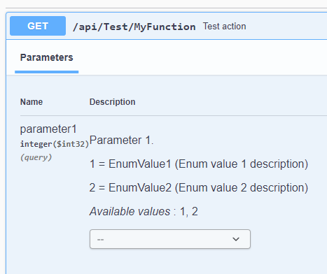

# Road map

- [ ] Add unit-tests
- [ ] Fix open [issues](https://github.com/unchase/Unchase.Swashbuckle.AspNetCore.Extensions/issues/)
- [ ] Gather [feedback](https://github.com/unchase/Unchase.Swashbuckle.AspNetCore.Extensions/issues/new) and plan further features to implement

# Change log

These are the changes to each version that has been released on the [nuget](https://www.nuget.org/packages/Unchase.Swashbuckle.AspNetCore.Extensions/).

## v2.6.12 `2021-10-05`

- [x] Fix [#17](https://github.com/unchase/Unchase.Swashbuckle.AspNetCore.Extensions/issues/17): check schema for null in `DisplayEnumsWithValuesDocumentFilter`

## v2.6.11 `2021-09-29`

- [x] Fix [#18](https://github.com/unchase/Unchase.Swashbuckle.AspNetCore.Extensions/issues/18): add aliases for "x-enumNames" and "x-enumDescriptions"

## v2.6.9 `2021-08-30`

- [x] Fix NRE in `InheritDocRequestBodyFilter` and `InheritDocParameterFilter`

## v2.6.8 `2021-08-26`

- [x] Add `IncludeXmlCommentsWithRemarks` improvements

## v2.6.7 `2021-08-26`

- [x] Add message template for `AppendActionCountToTagSummaryDocumentFilter`

## v2.6.6 `2021-08-26`

- [x] Add `IncludeXmlCommentsWithRemarks` improvements

## v2.6.3 `2021-08-26`

- [x] Fix `IncludeXmlCommentsWithRemarks`

## v2.6.1 `2021-08-26`

- [x] Update nuget-dependencies: update Swashbuckle.AspNetCore to [v6.1.5](https://github.com/domaindrivendev/Swashbuckle.AspNetCore/releases/tag/v6.1.5)

## v2.6.0 `2021-02-09`

- [x] Update nuget-dependencies: update Swashbuckle.AspNetCore to [v6.1.0](https://github.com/domaindrivendev/Swashbuckle.AspNetCore/releases/tag/v6.1.0)
- [x] Fix `DisplayEnumsWithValuesDocumentFilter` for action enum parameters like:

```csharp
[HttpGet("MyFunction")]
public IActionResult MyFunction(ParameterEnum parameter1)
{
    return NoContent();
}
```



## v2.5.2 `2021-02-09`

- [x] Add more overloads for `IncludeXmlCommentsWithRemarks` extension method
- [x] Update nuget-dependencies: update Swashbuckle.AspNetCore to v6.0.2

## v2.5.1 `2021-02-05`

- [x] Update nuget-dependencies: update Swashbuckle.AspNetCore to [v6.0.0](https://github.com/domaindrivendev/Swashbuckle.AspNetCore/releases/tag/v6.0.0)

## v2.5.0 `2020-10-15`

- [x] Fix some bugs in `IncludeXmlCommentsWithRemarks` option
- [x] Add `IncludeXmlCommentsFromInheritDocs` option to add xml comments from inheritdocs (from summary and remarks) into the swagger documentation

## v2.4.1 `2020-10-13`

- [x] Add `params Type[]` parameters to `IncludeXmlCommentsWithRemarks` option to exclude remarks for concrete types

## v2.4.0 `2020-10-11`

- [x] Add `IncludeXmlCommentsWithRemarks` option to add xml comments from summary and remarks into the swagger documentation
- [x] Update nuget-dependencies

## v2.3.13 `2020-10-07`

- [x] Add `IncludeXEnumRemarks` option to include remarks for descriptions from xml-comments
- [x] Fix small bugs 

## v2.3.12 `(2020-09-21)`

- [x] Fix [issue #11](https://github.com/unchase/Unchase.Swashbuckle.AspNetCore.Extensions/issues/11)

## v2.3.11 `(2020-09-17)`

- [x] Fix bug related with removal of required schemes from `AllOf` using `HidePathsAndDefinitionsByRolesDocumentFilter`

## v2.3.10 `(2020-07-29)`

- [x] Fix [issue #13](https://github.com/unchase/Unchase.Swashbuckle.AspNetCore.Extensions/issues/13)
- [x] Fix [issue #14](https://github.com/unchase/Unchase.Swashbuckle.AspNetCore.Extensions/issues/14)

## v2.3.9 `(2020-07-28)`

- [x] Update nuget dependencies for sample WebAPI
- [x] Fix [issue #12](https://github.com/unchase/Unchase.Swashbuckle.AspNetCore.Extensions/issues/12)

## v2.3.8 `(2020-07-06)`

- [x] Fix bug with missed required definitions in `HidePathsAndDefinitionsByRolesDocumentFilter`

## v2.3.7 `(2020-07-06)`

- [x] Fix bug with missed required definitions in `HidePathsAndDefinitionsByRolesDocumentFilter`

## v2.3.6 `(2020-07-06)`

- [x] Fix bug with OpenAPI operation RequestBody in `HidePathsAndDefinitionsByRolesDocumentFilter`

## v2.3.5 `(2020-07-06)`

- [x] Fix bug in `HidePathsAndDefinitionsByRolesDocumentFilter`

## v2.3.4 `(2020-06-11)`

- [x] Fix [bug #10](https://github.com/unchase/Unchase.Swashbuckle.AspNetCore.Extensions/issues/10)

## v2.3.3 `(2020-03-25)`

- [x] Add option to choose descriptions source - `FixEnumOptions.DescriptionSource`
- [x] Fix small bugs

## v2.3.2 `(2020-03-25)`

- [x] Fix bug with `System.MissingMethodException`

## v2.3.0 `(2020-03-23)`

- [x] Add feature: add configured options to `AddEnumsWithValuesFixFilters`
- [x] Fix bug: fix #7 - get descriptions from xml comments
- [x] Fix small bugs 

## v2.2.6 `(2020-03-22)`

- [x] Fix bug: add fix #6 to `options.AddEnumsWithValuesFixFilters(true);` when using `JsonStringEnumConverter()`

## v2.2.5 `(2020-03-02)`

- [x] Fix bug: hide Paths and Components with `AuthorizeAttribute` applied to the Controller

## v2.2.4 `(2020-03-02)`

- [x] Add `RemovePathsAndComponentsWithoutAcceptedRolesFor` overloaded extension method (with `actionName` parameter)

## v2.2.3 `(2020-03-02)`

- [x] Allow to use `RemovePathsAndComponentsWithoutAcceptedRolesForController` extension method without `new()` constraint

## v2.2.2 `(2020-02-29)`

- [x] Fix bug with `AmbiguousMatchException`

## v2.2.1 `(2020-02-29)`

- [x] Add feature: remove Paths and Definitions from OpenApi documentation for all controller actions without accepted roles

## v2.2.0 `(2020-02-28)`

- [x] Add feature: remove Paths and Definitions from OpenApi documentation for specific controller action without accepted roles

## v2.1.6 `(2020-02-21)`

- [x] Fix bug: replace `<br>` tag to `{Envirinment.NewLine}{Envirinment.NewLine}` for enum descriptions

## v2.1.5 `(2020-02-21)`

- [x] Fix bug: fix openApi response content schema in `ChangeResponseByHttpStatusCodeDocumentFilter`

## v2.1.4 `(2020-02-20)`

- [x] Add xml-comments to nuget package

## v2.1.1 `(2020-02-19)`

- [x] Fix bug: use `System.Text.Encodings.Web.JavaScriptEncoder.UnsafeRelaxedJsonEscaping` encoder for responses examples

## v2.1.0 `(2020-02-19)`

- [x] Add `ChangeAllResponsesByHttpStatusCode<T>` extension method for `SwaggerGenOptions` allows to change all responses by specific http status codes in OpenApi document
- [x] Add `TagOrderByNameDocumentFilter` for ordering tags by name in OpenApi document

## v2.0.0 `(2020-02-08)`

**BREAKING CHANGES (see [README.md](README.md)):**
- [x] Close [#2 issue](https://github.com/unchase/Unchase.Swashbuckle.AspNetCore.Extensions/issues/2): Add support for [Swashbuckle.AspNetCore 5.0.0](https://www.nuget.org/packages/Swashbuckle.AspNetCore/)

## v1.1.1 `(2019-05-14)`

- [x] Add `AppendActionCountToTagSummaryDocumentFilter` to append action count into the SwaggetTag's descriptions

## v1.1.0 `(2019-05-07)`

- [x] Add extension-method `HidePathItemsWithoutAcceptedRoles` for hiding all SwaggerDocument PathItems with added Security information for OAuth2 without accepted roles
- [x] Change extension-method name from `EnumsWithValuesFixFilters` to `AddEnumsWithValuesFixFilters`
- [x] Update [`README`](https://github.com/unchase/Unchase.Swashbuckle.AspNetCore.Extensions/)

## v1.0.0 `(2019-05-01)`

- [x] Add an output enums integer values with there strings like `0 = FirstEnumValue` without a `StringEnumConverter` in swaggerUI and schema (by default enums will output only their integer values)
- [x] Add description to each enum value that has an `[Description]` attribute in `swaggerUI` and schema
- [x] Fix enum values in generated by [`NSwagStudio`](https://github.com/RicoSuter/NSwag/wiki/NSwagStudio) or [Unchase OpenAPI Connected Service](https://marketplace.visualstudio.com/items?itemName=Unchase.unchaseopenapiconnectedservice) client classes
- [x] Add `Getting Started` overview to GitHub [`README`](https://github.com/unchase/Unchase.Swashbuckle.AspNetCore.Extensions/)
- [x] Release version of `Unchase Swashbuckle Asp.Net Core Extensions`
