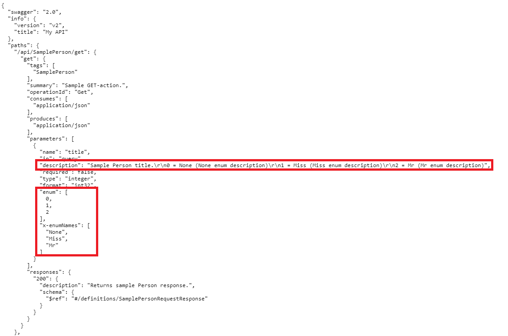
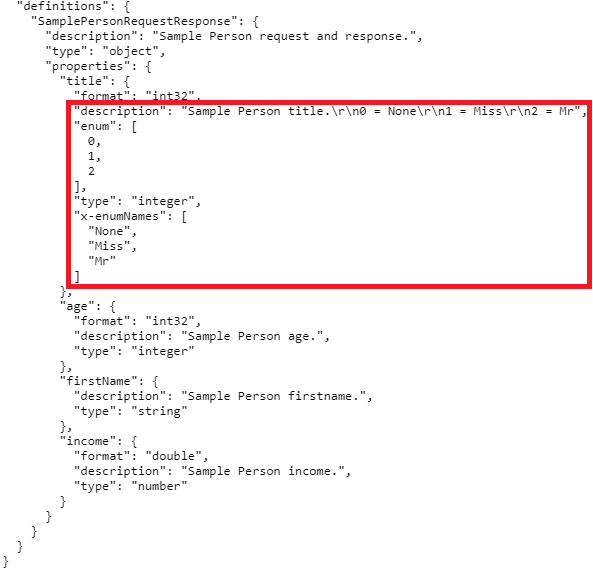
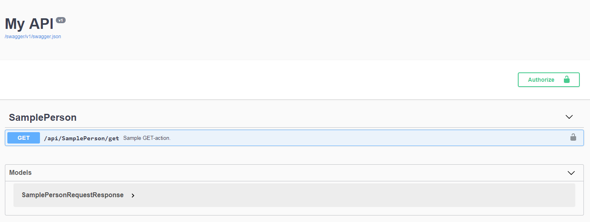
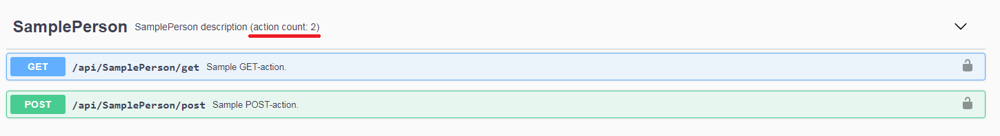
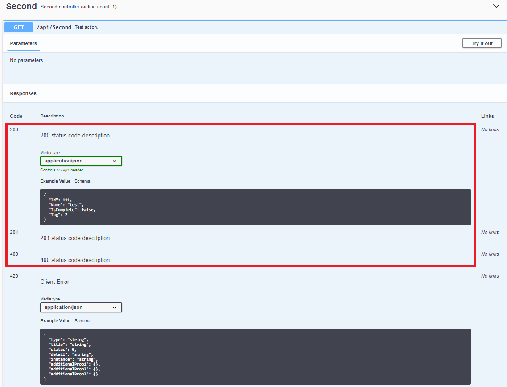
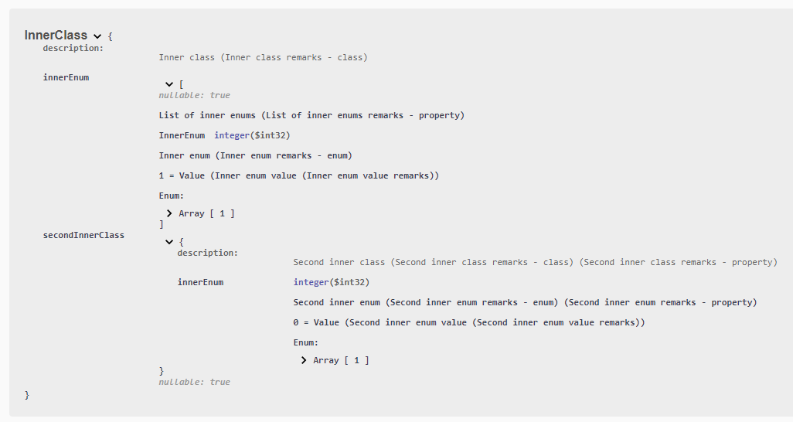
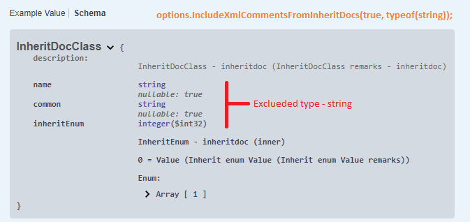

<p align="center">
  <a href="https://www.nuget.org/packages/Unchase.Swashbuckle.AspNetCore.Extensions/">
    
  </a>
</p>

[Unchase Swashbuckle Asp.Net Core Extensions](https://www.nuget.org/packages/Unchase.Swashbuckle.AspNetCore.Extensions/) is a library contains a bunch of extensions (filters) for [Swashbuckle.AspNetCore](https://github.com/domaindrivendev/Swashbuckle.AspNetCore).

> The project is developed and maintained by [Nikolay Chebotov (**Unchase**)](https://github.com/unchase).

## Breaking Changes

* Since [v2.0.0](https://github.com/unchase/Unchase.Swashbuckle.AspNetCore.Extensions/releases/tag/v2.0.0) supports [Swashbuckle.AspNetCore 5.0.0](https://www.nuget.org/packages/Swashbuckle.AspNetCore/) with **breaking changes**.

For old versions see [README_OLD.md](README_OLD.md).

* Since [v2.3.0](https://github.com/unchase/Unchase.Swashbuckle.AspNetCore.Extensions/releases/tag/v2.3.0) there are [**breaking changes**](#breaking-changes-2.3.0) in `Startup.cs`

### Compatibility

|Swashbuckle Version|ASP.NET Core|Swagger / OpenAPI Spec.|This extension Version|
|:------------------|:-----------|:----------------------|:---------------------|
|[master](https://github.com/domaindrivendev/Swashbuckle.AspNetCore/tree/master/README.md)|>= 2.0.0|2.0, 3.0|[master](https://github.com/unchase/Unchase.Swashbuckle.AspNetCore.Extensions/tree/master/README.md)|
|[6.1.5](https://github.com/domaindrivendev/Swashbuckle.AspNetCore/tree/v6.1.5)|>= 2.0.0|2.0, 3.0|[v2.6.1](https://github.com/unchase/Unchase.Swashbuckle.AspNetCore.Extensions/tree/v2.6.1/README.md)|
|[6.1.0](https://github.com/domaindrivendev/Swashbuckle.AspNetCore/tree/v6.1.0)|>= 2.0.0|2.0, 3.0|[v2.6.0](https://github.com/unchase/Unchase.Swashbuckle.AspNetCore.Extensions/tree/v2.6.0/README.md)|
|[6.0.0](https://github.com/domaindrivendev/Swashbuckle.AspNetCore/tree/v6.0.0)|>= 2.0.0|2.0, 3.0|[v2.5.1](https://github.com/unchase/Unchase.Swashbuckle.AspNetCore.Extensions/tree/v2.5.1/README.md)|
|[5.0.0](https://github.com/domaindrivendev/Swashbuckle.AspNetCore/tree/v5.0.0)|>= 2.0.0|2.0, 3.0|[v2.0.0](https://github.com/unchase/Unchase.Swashbuckle.AspNetCore.Extensions/tree/v2.0.0/README.md)|
|[4.0.0](https://github.com/domaindrivendev/Swashbuckle.AspNetCore/tree/v4.0.0)|>= 2.0.0, < 3.0.0|2.0|[v1.1.4](https://github.com/unchase/Unchase.Swashbuckle.AspNetCore.Extensions/tree/v1.1.4/README.md)|

## Getting Started

To use the extensions, install [*NuGet* package](https://www.nuget.org/packages/Unchase.Swashbuckle.AspNetCore.Extensions/) into your project:

#### Manually with the *NuGet* Package Manager:

```powershell
Install-Package Unchase.Swashbuckle.AspNetCore.Extensions
```

#### Using the .NET CLI:

```powershell
dotnet add package Unchase.Swashbuckle.AspNetCore.Extensions --version {version}
```

> Where {version} is the version of the package you want to install. 
> For example, `dotnet add package Unchase.Swashbuckle.AspNetCore.Extensions --version 2.4.0`

Then use whichever extensions (filters) you need.

## Extensions (Filters) use

Ensure your API actions and parameters are decorated with explicit **"Http"** and **"From"** (optional) bindings.

```csharp
[HttpPost]
public void CreateProduct([FromBody]Product product)
...
```

```csharp
[HttpGet]
public IEnumerable<Product> SearchProducts([FromQuery]string keywords)
...
```

In the `Configure` method, insert middleware to expose the generated Swagger as JSON endpoint(s):

```csharp
app.UseSwagger();
```

Optionally, insert the swagger-ui middleware if you want to expose interactive documentation, specifying the Swagger JSON endpoint(s) to power it from:

```csharp
app.UseSwaggerUI(c =>
{
    c.SwaggerEndpoint("/swagger/v1/swagger.json", "My API V1");
});
```

1. **Fix enums in OpenApi document**:
- In the _ConfigureServices_ method of _Startup.cs_, inside your `AddSwaggerGen` call, enable whichever extensions (filters) you need:

```csharp
using Unchase.Swashbuckle.AspNetCore.Extensions.Extensions;
using Unchase.Swashbuckle.AspNetCore.Extensions.Filters;
```

* <a name="breaking-changes-2.3.0"></a> Since [v2.3.0](https://github.com/unchase/Unchase.Swashbuckle.AspNetCore.Extensions/releases/tag/v2.3.0):

```csharp
// This method gets called by the runtime. Use this method to add services to the container.
public void ConfigureServices(IServiceCollection services)
{
    // Add framework services.
    services.AddControllers();

    // Register the Swagger generator
    services.AddSwaggerGen(options =>
    {
        options.SwaggerDoc("v1", new OpenApiInfo { Title = "My API", Version = "v1" });

        // use it if you want to hide Paths and Definitions from OpenApi documentation correctly
        options.UseAllOfToExtendReferenceSchemas();

        // if you want to add xml comments from summary and remarks into the swagger documentation, first of all add:
        // you can exclude remarks for concrete types
        var xmlFilePath = Path.Combine(AppContext.BaseDirectory, "WebApi3.1-Swashbuckle.xml");
        options.IncludeXmlCommentsWithRemarks(xmlFilePath, false,
            typeof(ComplicatedClass),
            typeof(InnerEnum));

        // or add without remarks
        //options.IncludeXmlComments(xmlFilePath);

        // if you want to add xml comments from inheritdocs (from summary and remarks) into the swagger documentation, add:
        // you can exclude remarks for concrete types
        options.IncludeXmlCommentsFromInheritDocs(includeRemarks: true, excludedTypes: typeof(string));

        // Add filters to fix enums
        // use by default:
        //options.AddEnumsWithValuesFixFilters();

        // or configured:
        options.AddEnumsWithValuesFixFilters(services, o =>
        {
            // add schema filter to fix enums (add 'x-enumNames' for NSwag) in schema
            o.ApplySchemaFilter = true;

            // add parameter filter to fix enums (add 'x-enumNames' for NSwag) in schema parameters
            o.ApplyParameterFilter = true;

            // add document filter to fix enums displaying in swagger document
            o.ApplyDocumentFilter = true;

            // add descriptions from DescriptionAttribute or xml-comments to fix enums (add 'x-enumDescriptions' for schema extensions) for applied filters
            o.IncludeDescriptions = true;

            // add remarks for descriptions from xml-comments
            o.IncludeXEnumRemarks = true;

            // get descriptions from DescriptionAttribute then from xml-comments
            o.DescriptionSource = DescriptionSources.DescriptionAttributesThenXmlComments;

            // get descriptions from xml-file comments on the specified path
            // should use "options.IncludeXmlComments(xmlFilePath);" before
            o.IncludeXmlCommentsFrom(xmlFilePath);
            // the same for another xml-files...
        });
    });
}
```

* For older versions:

```csharp
// This method gets called by the runtime. Use this method to add services to the container.
public void ConfigureServices(IServiceCollection services)
{
    // Add framework services.
    services.AddMvc();

    services.AddSwaggerGen(options =>
    {
        options.SwaggerDoc("v1", new OpenApiInfo { Title = "My API", Version = "v1" });

        // if you want to add xml comments into the swagger documentation, first of all add:
        var filePath = Path.Combine(AppContext.BaseDirectory, "WebApi3.1-Swashbuckle.xml");
        options.IncludeXmlComments(filePath);

        // Add filters to fix enums
        options.AddEnumsWithValuesFixFilters(true);

        // or custom use:
        //options.SchemaFilter<XEnumNamesSchemaFilter>(true); // add schema filter to fix enums (add 'x-enumNames' for NSwag) in schema
        //options.ParameterFilter<XEnumNamesParameterFilter>(true); // add parameter filter to fix enums (add 'x-enumNames' for NSwag) in schema parameters
        //options.DocumentFilter<DisplayEnumsWithValuesDocumentFilter>(true); // add document filter to fix enums displaying in swagger document
    });
}
```

2. **Hide Paths and Definitions from OpenApi documentation** without accepted roles: 
- In the _ConfigureServices_ method of _Startup.cs_, inside your `AddSwaggerGen` call, enable `HidePathsAndDefinitionsByRolesDocumentFilter` document filter:

```csharp
// This method gets called by the runtime. Use this method to add services to the container.
public void ConfigureServices(IServiceCollection services)
{
    ...

    services.AddSwaggerGen(options =>
    {
        ...

        // remove Paths and Defenitions from OpenApi documentation without accepted roles
        options.DocumentFilter<HidePathsAndDefinitionsByRolesDocumentFilter>(new List<string> { "AcceptedRole" });
    });
}
```

- Since [v2.2.1](https://github.com/unchase/Unchase.Swashbuckle.AspNetCore.Extensions/releases/tag/v2.2.1) you can hide Paths and Definitions from OpenApi documentation for specific controller action (or all actions) without accepted roles like this:

```csharp
// This method gets called by the runtime. Use this method to configure the HTTP request pipeline.
public void Configure(IApplicationBuilder app, IWebHostEnvironment env)
{
    //...    

    // enable middleware to serve generated Swagger as a JSON endpoint.
    app.UseSwagger(c =>
    {
        c.PreSerializeFilters.Add((openApiDoc, httpRequest) =>
        {
            // remove Paths and Components from OpenApi documentation for specific controller action without accepted roles
            openApiDoc.RemovePathsAndComponentsWithoutAcceptedRolesFor<SomeController>(controller => nameof(controller.SomeAction), new List<string> {"AcceptedRole"});

            // or
            //openApiDoc.RemovePathsAndComponentsWithoutAcceptedRolesFor<SomeController>(nameof(SomeController.SomeAction), new List<string> { "AcceptedRole" });


            // remove Paths and Components from OpenApi documentation for all controller actions without accepted roles
            openApiDoc.RemovePathsAndComponentsWithoutAcceptedRolesForController<AnotherController>(new List<string> {"AcceptedRole"});

            // or you can get accepted roles by httpRequest like this:
            //openApiDoc.RemovePathsAndComponentsWithoutAcceptedRolesForController<AnotherController>(GetAcceptedRolesByRemoteIp(httpRequest.HttpContext.Connection.RemoteIpAddress));
        });
    });

    //...
}
```

Validated actions must be annotated with the one of `HttpMethodAttribute` (`HttpGetAttribute`, `HttpPostAttribute`, `HttpDeleteAttribute`, `HttpPutAttribute`, `HttpPatchAttribute`) attributes.

3. **Append action count into the SwaggetTag's descriptions in OpenApi document**:
- In the _ConfigureServices_ method of _Startup.cs_, inside your `AddSwaggerGen` call, enable `AppendActionCountToTagSummaryDocumentFilter` document filter:

```csharp
// This method gets called by the runtime. Use this method to add services to the container.
public void ConfigureServices(IServiceCollection services)
{
    ...

    services.AddSwaggerGen(options =>
    {
        ...

        // enable openApi Annotations
        options.EnableAnnotations();

        // add action count into the SwaggerTag's descriptions
        // you can use it after "HidePathsAndDefinitionsByRolesDocumentFilter"
        options.DocumentFilter<AppendActionCountToTagSummaryDocumentFilter>();

        ...
    });
}
```

In the controller need to use `SwaggerTag` attribute:

```csharp
using Swashbuckle.AspNetCore.Annotations;
```

```csharp
[SwaggerTag("Controller for todo")]
public class TodoController : ControllerBase
...
```

4. **Change all responses for specific HTTP status codes in OpenApi document**:
- In the _ConfigureServices_ method of _Startup.cs_, inside your `AddSwaggerGen` call, enable `ChangeAllResponsesByHttpStatusCode<T>` extension (filter) with whichever HTTP status codes you need:

```csharp
// This method gets called by the runtime. Use this method to add services to the container.
public void ConfigureServices(IServiceCollection services)
{
    ...

    services.AddSwaggerGen(options =>
    {
        ...

        // change responses for specific HTTP status code ("200")
        options.ChangeAllResponsesByHttpStatusCode(
            httpStatusCode: 200,
            responseDescription: "200 status code description",
            responseExampleOption : ResponseExampleOptions.AddNew, // add new response examples
            responseExample: new TodoItem { Tag = Tag.Workout, Id = 111, IsComplete = false, Name = "test" }); // some class for response examples
        
        // change responses for specific HTTP status code ("400" (HttpStatusCode.BadRequest))
        options.ChangeAllResponsesByHttpStatusCode(
            httpStatusCode: HttpStatusCode.BadRequest,
            responseDescription: "400 status code description",
            responseExampleOption: ResponseExampleOptions.Clear, // claer response examples
            responseExample: new ComplicatedClass()); // some class for response examples
        
        // change responses for specific HTTP status code ("201" (StatusCodes.Status201Created))
        options.ChangeAllResponsesByHttpStatusCode(
            httpStatusCode: StatusCodes.Status201Created,
            responseDescription: "201 status code description",
            responseExampleOption: ResponseExampleOptions.None, // do nothing with response examples
            responseExample: new ComplicatedClass()); // some class for response examples

        ...
    });
}
```

5. **Order tags by name in OpenApi document**:
- In the _ConfigureServices_ method of _Startup.cs_, inside your `AddSwaggerGen` call, enable `TagOrderByNameDocumentFilter` document filter:

```csharp
// This method gets called by the runtime. Use this method to add services to the container.
public void ConfigureServices(IServiceCollection services)
{
    ...

    services.AddSwaggerGen(options =>
    {
        ...

        // order tags by name
        options.DocumentFilter<TagOrderByNameDocumentFilter>();

        ...
    });
}
```

6. **Add xml comments from summary and remarks into the swagger documentation**:

- Since [v2.4.0](https://github.com/unchase/Unchase.Swashbuckle.AspNetCore.Extensions/releases/tag/v2.4.0) in the _ConfigureServices_ method of _Startup.cs_, inside your `AddSwaggerGen` call, add `IncludeXmlCommentsWithRemarks` option instead of `IncludeXmlComments` option:

```csharp
// This method gets called by the runtime. Use this method to add services to the container.
public void ConfigureServices(IServiceCollection services)
{
    ...

    services.AddSwaggerGen(options =>
    {
        ...

        // add xml comments from summary and remarks into the swagger documentation
        options.IncludeXmlCommentsWithRemarks("<xml_File_Full_Path>");

        // add xml comments from summary and remarks into the swagger documentation
        // with excluding remarks for concrete types (since v2.4.1)
        var xmlFilePath = Path.Combine(AppContext.BaseDirectory, "WebApi3.1-Swashbuckle.xml");
        options.IncludeXmlCommentsWithRemarks(xmlFilePath, false,
            typeof(ComplicatedClass),
            typeof(InnerEnum));

        ...
    });
}
```

7. **Add xml comments from &lt;inheritdoc/&gt; (from summary and remarks) into the swagger documentation**:

- Since [v2.5.0](https://github.com/unchase/Unchase.Swashbuckle.AspNetCore.Extensions/releases/tag/v2.5.0) in the _ConfigureServices_ method of _Startup.cs_, inside your `AddSwaggerGen` call, add `IncludeXmlCommentsFromInheritDocs` option:

```csharp
// This method gets called by the runtime. Use this method to add services to the container.
public void ConfigureServices(IServiceCollection services)
{
    ...

    services.AddSwaggerGen(options =>
    {
        ...

        // add xml comments from inheritdocs (from summary and remarks) into the swagger documentation, add:
        // with excluding concrete types
        options.IncludeXmlCommentsFromInheritDocs(includeRemarks: true, excludedTypes: typeof(string));

        ...
    });
}
```

## Builds status

|Status|Value|
|:-----|:---:|
|Build|[](https://ci.appveyor.com/project/unchase/unchase-swashbuckle-aspnetcore-extensions)
|Tests|[](https://ci.appveyor.com/project/unchase/unchase-swashbuckle-aspnetcore-extensions/build/tests)
|Buid History|
|GitHub Release|[](https://github.com/unchase/unchase.swashbuckle.aspnetcore.extensions/releases/latest)
|GitHub Release Date|[](https://github.com/unchase/unchase.swashbuckle.aspnetcore.extensions/releases/latest)
|GitHub Release Downloads|[](https://github.com/unchase/unchase.swashbuckle.aspnetcore.extensions/releases/latest)
|Nuget Version|[](https://www.nuget.org/packages/Unchase.Swashbuckle.AspNetCore.Extensions/) 
|Nuget Downloads|[](https://www.nuget.org/packages/Unchase.Swashbuckle.AspNetCore.Extensions/)

## Features

### Fix enums

- Add an output enums integer values with there strings like `0 = FirstEnumValue` without a `StringEnumConverter` in swaggerUI and schema (by default enums will output only their integer values)
- Add description to each enum value that has an `[Description]` attribute in `swaggerUI` and schema - should use *options.DocumentFilter\<DisplayEnumsWithValuesDocumentFilter\>(**true**);* or *options.AddEnumsWithValuesFixFilters(**true**);*

    In [`Swashbuckle SwaggerUI`](https://github.com/domaindrivendev/Swashbuckle):

    

    In schema `parameters`:

    

    In schema `definitions`:

    

    To show enum values descriptions you should use `[Description]` attribute in your code:

    ```csharp
    /// <summary>
    /// Title enum.
    /// </summary>
    [DataContract]
    public enum Title
    {
        /// <summary>
        /// None.
        /// </summary>
        [Description("None enum description")]
        [EnumMember]
        None = 0,

        /// <summary>
        /// Miss.
        /// </summary>
        [Description("Miss enum description")]
        [EnumMember]
        Miss,

        /// <summary>
        /// Mr.
        /// </summary>
        [Description("Mr enum description")]
        [EnumMember]
        Mr
    }

    ...

    /// <summary>
    /// Sample Person request and response.
    /// </summary>
    public class SamplePersonRequestResponse
    {
        /// <summary>
        /// Sample Person title.
        /// </summary>
        public Title Title { get; set; }

        /// <summary>
        /// Sample Person age.
        /// </summary>
        public int Age { get; set; }

        /// <summary>
        /// Sample Person firstname.
        /// </summary>
        [Description("The first name of the person")]
        public string FirstName { get; set; }

        /// <summary>
        /// Sample Person income.
        /// </summary>
        public decimal? Income { get; set; }
    }
    ```
 - Fix enum values in generated by [`NSwagStudio`](https://github.com/RicoSuter/NSwag/wiki/NSwagStudio) or [Unchase OpenAPI Connected Service](https://marketplace.visualstudio.com/items?itemName=Unchase.unchaseopenapiconnectedservice) client classes:

    ```csharp
    /// <summary>Sample Person title.
    ///
    /// 0 = None (None enum description)
    ///
    /// 1 = Miss (Miss enum description)
    ///
    /// 2 = Mr (Mr enum description)</summary>
    [System.CodeDom.Compiler.GeneratedCode("NJsonSchema", "9.13.35.0 (Newtonsoft.Json v11.0.0.0)")]
    public enum Title
    {
        None = 0,
    
        Miss = 1,
    
        Mr = 2,
    
    }
    ```

### Hide Paths and Defenitions from OpenApi documentation

- Hide all OpenAPIDocument **Paths** and **Defenitions** without accepted roles:

    

    You should use `AuthorizeAttribute` for methods or controllers:

    ```csharp
    ...
    public class SamplePersonController : ControllerBase
    {
        // this method will not be hidden with using 'swaggerDoc.HidePathItemsWithoutAcceptedRoles(new List<string> {"AcceptedRole"});'
        [Authorize(Roles = "AcceptedRole")]
        [HttpGet]
        public ActionResult<SamplePersonRequestResponse> Get(Title title)
        {
            ...
        }

        // this method will be hidden with using 'swaggerDoc.HidePathItemsWithoutAcceptedRoles(new List<string> {"AcceptedRole"});'
        [Authorize(Roles = "NotAcceptedRole")]
        [HttpPost]
        public ActionResult<SamplePersonRequestResponse> Post([FromBody] SamplePersonRequestResponse request)
        {
            ...
        }
    }
    ```

### Append action count into the SwaggetTag's descriptions



You should use `SwaggerTagAttribute` for controllers:

```csharp
[SwaggerTag("SamplePerson description")]
public class SamplePersonController : ControllerBase
{
    ...
}
```

### Change responses for specific HTTP status codes

For example:



### Add xml comments from summary and remarks into the swagger documentation



For code:

```csharp
/// <summary>
/// Inner class
/// </summary>
/// <remarks>
/// Inner class remarks - class
/// </remarks>
public class InnerClass
{
    /// <summary>
    /// List of inner enums
    /// </summary>
    /// <remarks>
    /// List of inner enums remarks - property
    /// </remarks>
    public List<InnerEnum> InnerEnum { get; set; }

    /// <summary>
    /// Second inner class
    /// </summary>
    /// <remarks>
    /// Second inner class remarks - property
    /// </remarks>
    public SecondInnerClass<SecondInnerEnum> SecondInnerClass { get; set; }
}

/// <summary>
/// Inner enum
/// </summary>
/// <remarks>
/// Inner enum remarks - enum
/// </remarks>
public enum InnerEnum
{
    /// <summary>
    /// Inner enum value
    /// </summary>
    /// <remarks>
    /// Inner enum value remarks
    /// </remarks>
    Value = 1
}

/// <summary>
/// Second inner class
/// </summary>
/// <remarks>
/// Second inner class remarks - class
/// </remarks>
public class SecondInnerClass<T> where T : Enum
{
    /// <summary>
    /// Second inner enum
    /// </summary>
    /// <remarks>
    /// Second inner enum remarks - property
    /// </remarks>
    public T InnerEnum { get; set; }
}

/// <summary>
/// Second inner enum
/// </summary>
/// <remarks>
/// Second inner enum remarks - enum
/// </remarks>
public enum SecondInnerEnum
{
    /// <summary>
    /// Second inner enum value
    /// </summary>
    /// <remarks>
    /// Second inner enum value remarks
    /// </remarks>
    Value = 0
}
```

### Add xml comments from &lt;inheritdoc/&gt; (from summary and remarks) into the swagger documentation



For code:

```csharp
/// <inheritdoc cref="IInheritDocClass"/>
public class InheritDocClass : IInheritDocClass
{
    /// <inheritdoc/>
    public string Name { get; set; }

    /// <inheritdoc/>
    public string Common { get; set; }

    /// <inheritdoc/>
    public InheritEnum InheritEnum { get; set; }
}

/// <summary>
/// InheritDocClass - inheritdoc
/// </summary>
/// <remarks>
/// InheritDocClass remarks - inheritdoc
/// </remarks>
public interface IInheritDocClass : IInheritDocCommon
{
    /// <summary>
    /// Name - inheritdoc
    /// </summary>
    /// <remarks>
    /// Name remarks - inheritdoc
    /// </remarks>
    public string Name { get; set; }
}

/// <summary>
/// IInheritDocCommon interface
/// </summary>
/// <remarks>
/// IInheritDocCommon interface remarks
/// </remarks>
public interface IInheritDocCommon
{
    /// <summary>
    /// Common - inheritdoc (inner)
    /// </summary>
    /// <remarks>
    /// Common remarks - inheritdoc (inner)
    /// </remarks>
    public string Common { get; set; }

    /// <summary>
    /// InheritEnum - inheritdoc (inner)
    /// </summary>
    public InheritEnum InheritEnum { get; set; }
}

/// <summary>
/// Inherit enum - enum
/// </summary>
/// <remarks>
/// Inherit enum remarks - enum
/// </remarks>
public enum InheritEnum
{
    /// <summary>
    /// Inherit enum Value
    /// </summary>
    /// <remarks>
    /// Inherit enum Value remarks
    /// </remarks>
    Value = 0
}
```

## HowTos

- [ ] Add HowTos in a future
- [ ] ... [request for HowTo you need](https://github.com/unchase/Unchase.Swashbuckle.AspNetCore.Extensions/issues/new?title=DOC)

## Roadmap

See the [changelog](CHANGELOG.md) for the further development plans and version history.

## Feedback

Please feel free to add your [request a feature](https://github.com/unchase/Unchase.Swashbuckle.AspNetCore.Extensions/issues/new?title=FEATURE) or [report a bug](https://github.com/unchase/Unchase.Swashbuckle.AspNetCore.Extensions/issues/new?title=BUG). Thank you in advance!

## Thank me!

If you like what I am doing and you would like to thank me, please consider:

[](https://www.buymeacoffee.com/nikolaychebotov)

Thank you for your support!

----------

Copyright &copy; 2019 [Nikolay Chebotov (**Unchase**)](https://github.com/unchase) - Provided under the [Apache License 2.0](LICENSE).

